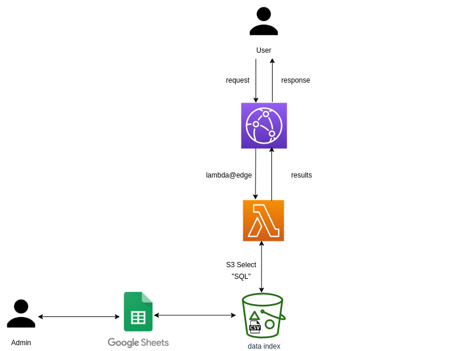

# Super Simple Search

## Arquitectura

## Desplegament

* Serverless framework (https://www.serverless.com/framework/docs/providers/aws/guide/installation/)

* Modifica els paràmetres del fitxer [setup.demo.json](setup.demo.json)

    * El "distributionId" l'hauràs d'afegir després de la creació de la distribució de cloudfront 

    * Un cop modificat

            $ sls deploy

* Crea un spreadsheet a Google i afegeix el [Google App Script](google-apps-script/index.gs) amb l'editor de scripts. Necessitaràs informar les següents variables com a propietats de l'script

    * **x-api-key**: la mateixa que a setup.demo.json, per a les invalidacions de cache
    * **KEY**: aws key de l'usuari amb permisos sobre el bucket al que pujar l'índex (s'ha de crear a AWS IAM)
    * **SECRET**: aws secret de l'usuari amb permisos sobre el bucket al que pujar l'índex
    * **domain**: cloudfront dns
    * **bucket**: el mateix bucket que el definit a setup.demo.json
    * **file**: el mateix fitxer d'índex que el definit a setup.demo.json

* Un cop tinguis el dns de la distribució cloudfront, també has de modificar al fitxer [frontend/index.html](frontend/index.html) la línea

        const cloudfrontDNS = "xxxxxxxxxx.cloudfront.net";

